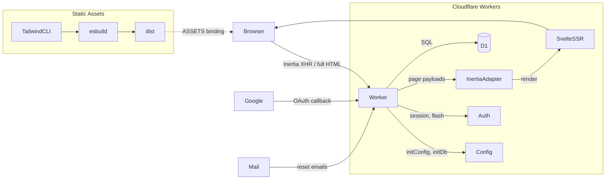

# Kilat

The Indonesian word for *lightning* — a full-stack edge starter that runs at the speed of light on Cloudflare's network.

[](LICENSE)
[](https://workers.cloudflare.com/)
[](https://hono.dev/)
[](https://developers.cloudflare.com/d1/)
[](https://svelte.dev/)
[](https://tailwindcss.com/)

A full-stack starter running entirely on **Cloudflare Workers**: **Hono** for
HTTP, **D1** for data, **Inertia v3** for server-driven UI with **in-process
SSR** — Svelte 5 `svelte/server` render runs inside a pre-built Worker bundle
(`dist/ssr.js`) — with auth, roles, migrations, and zero-config deploys. No
Docker, no VPS, no reverse proxy. `wrangler deploy` and you're live on 300+
edge locations.



## Philosophy

**Kilat** means *lightning* in Indonesian — and the name is the promise:
code that runs fast, deploys fast, and is understood fast. Not "clever fast"
— **predictably fast**. No surprises, no tricks that require the next
maintainer to reverse-engineer intent. Whoever comes later — human or AI
agent — should be able to understand the code, change it, and not be afraid
of breaking it.

- **Edge-native, zero ops.** No Docker, no VPS, no process supervisor. The
  whole stack is Cloudflare Workers: `wrangler dev` for local, `wrangler
  deploy` for production. D1 is the database, Workers Static Assets serves
  the client bundle, Web Crypto handles password hashing. Setup is three
  steps — install Bun, `git clone`, `wrangler deploy` — and you have a
  running app with auth, migrations, and SSR on 300+ edge locations.

- **Deliberately boring.** Every choice trades "clever" for "obviously
  right". When two ways of doing the same thing exist, only one is kept —
  the simpler one. Route handlers are written inline in their route file
  instead of being split into abstract controllers. Boring? Yes.
  Followable at a glance? Far more.

- **Zero-dependency where it's cheap.** Every dependency is a liability:
  it must be upgraded, audited, and can break under you. When 60 lines of
  our own code are enough, we write them: the rate limiter is a no-op stub
  (real limiting needs KV/DO — add when you need it), the Google OAuth
  client is plain `fetch` (no SDK), and the database layer is raw D1
  prepared statements — no ORM.

- **One obvious way to do things.** Structure is standardized, on purpose:
  routes only live in `routes/<feature>.routes.ts`, all SQL lives in
  `db.ts`, environment variables are read only in `config.ts`. No
  "structural creativity" — that is the point. When everyone writes the
  same way, anyone can find anything.

- **Discoverability as a contract.** Given a URL you can name the file
  that owns it: `/login` → `routes/auth.routes.ts`, `/profile` →
  `routes/profile.routes.ts`. Every URL lives in exactly one file, with
  its GET render and POST actions together. Paste a broken URL and you
  land in exactly one place — no guessing.

- **Production-grade guardrails, not a production app.** The
  infrastructure a deployed app needs — CSRF, security headers, versioned
  migrations, PBKDF2 password hashing, session management — is wired
  from day one, not scaffolded. What is missing is your business logic,
  and that is the point: you start from a skeleton that already works,
  not one you have to harden.

- **Correctness over cleverness.** Explicitly typed, parameterized
  queries; fail-fast configuration; deterministic tests. Prefer the
  boring implementation that is obviously correct over the clever one
  that is hard to verify.

- **Built for AI agents.** The "next maintainer" includes the agent
  writing the next feature — which, in this project, is the main way the
  code evolves. That is why conventions are codified where agents read
  them (`AGENTS.md`), validation errors have exact, documented shapes
  (TypeBox), mistakes fail at compile time (`strict` +
  `noUncheckedIndexedAccess`), and the test suite runs deterministically
  as the safety net. A codebase an agent can extend without inventing
  conventions is a codebase that stays coherent.

## Quick start

The fastest way to start a new Kilat project is the scaffolder:

```bash
bun create kilat my-app
```

The interactive prompt lets you pick a **framework** (React 19, Svelte 5,
Vue 3) and a **styling** approach (vanilla CSS or Tailwind CSS v4) via
arrow-key navigation. It downloads the template, patches `wrangler.toml`,
renames `package.json`, and runs `bun install` for you.

```bash
bun create kilat my-app --template svelte-tailwind   # skip prompts
bun create kilat .                                    # use current dir
bun create kilat my-app --no-install                  # skip bun install
```

Then:

```bash
cd my-app
bun run db:migrate    # create local D1 schema
bun run build         # build client assets + SSR bundle
bun run dev           # http://localhost:8787
```

### Templates

| Template            | Stack                              | Branch                    |
| ------------------- | ---------------------------------- | ------------------------- |
| `default`           | React 19 + vanilla CSS             | `main`                    |
| `react-tailwind`    | React 19 + Tailwind CSS v4         | `template/react-tailwind` |
| `svelte-vanilla`    | Svelte 5 + scoped `<style>` CSS    | `template/svelte-vanilla` |
| **`svelte-tailwind`** | **Svelte 5 + Tailwind CSS v4** | **`template/svelte-tailwind`** |
| `vue-vanilla`       | Vue 3 + scoped `<style>` CSS       | `template/vue-vanilla`    |
| `vue-tailwind`      | Vue 3 + Tailwind CSS v4            | `template/vue-tailwind`   |

### Manual clone

Alternatively, clone directly:

```bash
git clone https://github.com/maulanashalihin/kilat.git my-app
cd my-app
bun install

# Create a D1 database and apply migrations
npx wrangler d1 create kilat
# → copy the database_id into wrangler.toml
npx wrangler d1 migrations apply kilat --local

# Create the KV namespace for the rate limiter
npx wrangler kv namespace create RATE_LIMIT_KV
# → copy the id into wrangler.toml ([[kv_namespaces]] binding)

# Build client assets (required before first dev run)
bun run build

# Run locally
bun run dev          # http://localhost:8787

# Deploy to production
npx wrangler d1 migrations apply kilat --remote
bun run build
bun run deploy       # https://<your-worker>.<your-subdomain>.workers.dev
```

### Prerequisites

- **Bun >= 1.3** — package manager and script runner ([install](https://bun.sh))
- **Cloudflare account** — free tier is enough ([sign up](https://dash.cloudflare.com/sign-up))
- **Wrangler** — included as devDependency, or `npm i -g wrangler`

### Scripts

| Command             | What it does                                              |
| ------------------- | --------------------------------------------------------- |
| `bun run dev`       | Wrangler dev server (local D1 + Workers runtime)          |
| `bun run build`     | Tailwind CLI pre-step + two esbuild passes (client + SSR) → `dist/` (+ `manifest.json`, `dist/ssr.js`) |
| `bun run deploy`    | `wrangler deploy` to Cloudflare Workers edge              |
| `bun run db:migrate`     | Apply D1 migrations locally                          |
| `bun run db:migrate:remote` | Apply D1 migrations to remote (production)        |
| `bun run db:seed`   | Create a demo user (`[email] [password] [role]` args)     |
| `bun run typecheck` | `svelte-check --tsconfig ./tsconfig.json`                 |
| `bun run test`      | E2E suite (`bun test --isolate`)                          |

## Features

- **Auth**: register, login, logout — PBKDF2 passwords (Web Crypto, 100K
  iterations — Workers caps at 100K), DB-backed sessions (httpOnly
  `SameSite=Lax` cookies, 30-day expiry, `Secure` in production), CSRF
  (Origin check).
- **Forgot / reset password** with email delivery (see Mail below) and
  hashed reset tokens (60-minute expiry).
- **Google OAuth** register-or-login (zero-dep, plain fetch; button hidden
  when not configured).
- **Roles**: `user` / `admin`, `requireRole('admin')` guard, `/admin` page
  with paginated user list.
- **Inertia v3**: full SSR on first load, SPA navigation after, asset-version
  negotiation (409 + reload), partial reloads, flash messages, shared props.
- **Migrations**: versioned SQL files applied via `wrangler d1 migrations apply`.
- **Ops**: per-request logging with correlation ID, security headers (CSP,
  nosniff, frame denial), `/health` check, HSTS.
- **Testing**: `bun test` — boots the Hono app and drives it through
  `app.request()`.

## Configuration

Environment variables are set in `wrangler.toml` under `[vars]`. Sensitive
values (API keys, OAuth secrets) should use `wrangler secret put` instead.

| Variable | Default | Notes |
| --- | --- | --- |
| `NODE_ENV` | `development` | `production` enables Secure cookie flag |
| `SSR` | `true` | `false` ships an empty shell — client renders from scratch (no hydrate) |
| `MAIL_DRIVER` | `log` | `log` \| `resend` \| `mailtrap` |
| `MAIL_FROM` | `no-reply@example.com` | |
| `RESEND_API_KEY` | — | required when `MAIL_DRIVER=resend` (set via `wrangler secret put`) |
| `MAILTRAP_API_TOKEN` | — | required when `MAIL_DRIVER=mailtrap` (set via `wrangler secret put`) |
| `MAILTRAP_INBOX_ID` | — | use the sandbox endpoint when set |
| `GOOGLE_CLIENT_ID` / `GOOGLE_CLIENT_SECRET` | — | enable Google OAuth (set via `wrangler secret put`) |
| `RATE_LIMIT_GLOBAL_MAX` | `200` | global requests per window (all routes except `/health`, `/assets`, `/.well-known`) |
| `RATE_LIMIT_GLOBAL_WINDOW` | `60` | global window in seconds |
| `RATE_LIMIT_AUTH_MAX` | `30` | auth requests per window (`/login`, `/register`, password reset) |
| `RATE_LIMIT_AUTH_WINDOW` | `60` | auth window in seconds |

Invalid/incomplete config fails fast with a clear message
(`src/server/config.ts`).

### Google OAuth setup

1. [Google Cloud Console](https://console.cloud.google.com/apis/credentials) →
   create OAuth client (Web application).
2. Authorized redirect URI: `https://<your-worker>.workers.dev/auth/google/callback`
   (`http://localhost:8787/auth/google/callback` for local dev).
3. Set secrets: `npx wrangler secret put GOOGLE_CLIENT_ID` and
   `npx wrangler secret put GOOGLE_CLIENT_SECRET`.

### Mail drivers

- **log** (default): prints a formatted message and records it in
  `sentMails` — usable in dev and asserted in tests.
- **resend**: set `RESEND_API_KEY` (`MAIL_DRIVER=resend`).
- **mailtrap**: set `MAILTRAP_API_TOKEN` (`MAIL_DRIVER=mailtrap`); add
  `MAILTRAP_INBOX_ID` to use the sandbox endpoint.

## Architecture

AI agents: follow [`AGENTS.md`](AGENTS.md) — it codifies the layout rules
below so new code stays structurally consistent.

```
src/
├── worker.ts               # Cloudflare Workers entry: initConfig, initDb, app.fetch
├── server/
│   ├── app.ts              # composition: logging, CSRF, secureHeaders, onError, routes
│   ├── config.ts           # validated env config via initConfig(env) per-request
│   ├── db.ts               # D1 async query helpers (prepare/bind/first/all/run)
│   ├── auth.ts             # PBKDF2 (Web Crypto), sessions, flash, cookies, guards
│   ├── inertia.ts          # Inertia v3 server adapter (SSR shell, XHR, 409)
│   ├── inertia-middleware.ts # per-request session resolve → c.var (AppEnv)
│   ├── validation.ts       # TypeBox JSON validation → ValidationFailed (422)
│   ├── mailer.ts           # mail drivers: log / resend / mailtrap
│   ├── rate-limit.ts       # no-op stub (use KV/DO for real limiting)
│   ├── logger.ts           # per-request console.log + crypto.randomUUID
│   ├── security.ts         # CSRF origin check (headers via hono/secure-headers)
│   ├── url.ts              # defensive request-URL parsing
│   ├── assets.ts           # re-exports InertiaAssets type
│   └── routes/
│       ├── auth.routes.ts         # /login /register /logout /forgot/reset (GET+POST)
│       ├── google-oauth.routes.ts # /auth/google, /auth/google/callback
│       ├── pages.routes.ts        # app-shell pages: /, /dashboard, /admin
│       └── profile.routes.ts      # /profile page + /profile/avatar
├── client/
│   ├── app.ts              # Inertia client bootstrap (mount/hydrate)
│   ├── ssr.ts              # in-process SSR renderer (svelte/server) — pre-built to dist/ssr.js
│   ├── pages.ts            # explicit page registry (shared by SSR + bundle)
│   ├── pages/              # Login, Register, Dashboard, ForgotPassword,
│   │                       # ResetPassword, Admin, NotFound, Profile (.svelte)
│   ├── components/         # Layout, AuthLayout, Brand, Field (.svelte)
│   ├── styles.css          # global base: tokens, reset, shared UI primitives
│   └── tailwind.css        # Tailwind v4 entry: @import, @theme inline, dark variant
├── shared/
│   ├── types.ts            # User, Role, FlashData, SharedPageProps, Paginated
│   └── inertia.d.ts        # InertiaConfig augmentation → typed props.auth
├── migrations/             # versioned SQL schema files (0001, 0002, …)
└── tests/                  # bun:test E2E suite
scripts/
├── build.ts                # Tailwind CLI pre-step + esbuild: client bundle + SSR bundle (dist/ssr.js)
├── svelte-plugin.ts        # esbuild plugin: compiles .svelte SFCs (client + server modes)
└── seed.ts                 # wrangler d1 execute kilat --local + hashPassword
wrangler.toml               # Workers config: D1 binding, ASSETS binding, nodejs_compat, env vars
dist/                       # build output (gitignored), served by Workers Static Assets
```

## How the pieces fit

- **Request lifecycle**: `worker.ts` fetch handler → `initConfig(env)` +
  `initDb(env.DB)` → `app.fetch(request, env)` → `requestLogger` (correlation
  id) → `checkOrigin` (CSRF) → `secureHeaders` → inertia session resolve →
  guards + handler → Inertia render (SSR HTML for browsers, JSON for
  `X-Inertia` XHR) → `onError` (422 validation, 500) / `notFound` (404).
- **Auth**: PBKDF2 via `crypto.subtle` (100K iterations — Workers caps at
  100K, OWASP-acceptable for PBKDF2-HMAC-SHA256); 256-bit random session
  tokens in D1; cookies httpOnly/`SameSite=Lax`/Secure-in-prod. Logout
  deletes the session row server-side. `passwordHash` never leaves the
  server.
- **Guards** are Hono middleware: `requireAuth`, `guestOnly`,
  `requireRole('admin')` (non-admins redirect to `/dashboard`). They return
  a Response to short-circuit the chain, or call `next()`.
- **Inertia v3 protocol** (`inertia.ts`): full HTML with SSR markup +
  `data-page` JSON for browser visits; JSON page payloads for XHR;
  `409 + X-Inertia-Location` on asset-version mismatch; partial reloads via
  `X-Inertia-Partial-*`; one-shot flash and shared props merged per page.
- **SSR + hydration**: `renderPage()` renders with
  `createInertiaApp({ page, render })` using `svelte/server`; the client
  mounts/hydrates when `data-server-rendered` is present. The SSR bundle is
  pre-built to `dist/ssr.js` by `scripts/build.ts` (second esbuild pass with
  `sveltePlugin("server")`) because Wrangler's internal esbuild cannot
  compile `.svelte` files. `inertia.ts` imports `renderPage` from
  `../../dist/ssr.js`. Same page registry on both sides.
- **Asset versioning**: esbuild emits content-hashed files; the hash is
  the Inertia `version`. Stale clients get a 409 and reload. Run
  `bun run build` before `wrangler dev` or `wrangler deploy` when assets
  change.
- **Static assets**: served via Workers Static Assets binding (`env.ASSETS`).
  `run_worker_first = ["/*", "!/assets/*"]` in `wrangler.toml` means
  `/assets/*` bypasses the Worker and is served directly from the static
  asset binding — all other requests hit the Worker first.
- **Validation**: TypeBox schemas at the route level (see
  `src/server/validation.ts`); `onError` maps `ValidationFailed` to 422
  Inertia page payloads (`VALIDATION_MESSAGES` in
  `routes/auth.routes.ts`). The `email` format is registered explicitly —
  plain `@sinclair/typebox` does not pre-register string formats.

## Database migrations

Schema changes are plain SQL files in `migrations/`, applied via Wrangler:

```bash
# Apply to local D1 (dev)
npx wrangler d1 migrations apply kilat --local

# Apply to remote D1 (production)
npx wrangler d1 migrations apply kilat --remote
```

To add a new migration:

```bash
cat > migrations/0005_add_last_login.sql <<'SQL'
ALTER TABLE users ADD COLUMN last_login_at TEXT;
SQL

npx wrangler d1 migrations apply kilat --local
```

Rules:

- **Never edit an applied migration** — add a new numbered file instead.
- SQLite `ALTER TABLE ADD COLUMN` with `NOT NULL` requires a `DEFAULT`.
- To rebuild the local dev database from scratch, delete
  `.wrangler/state/v3/d1/` and re-apply migrations.

## Testing

```bash
bun test --isolate   # or: bun run test
```

The suite boots the Hono app and drives it through `app.request()`:
registration/login/logout, guards and roles, password reset end to end
(via the log mail driver), Inertia protocol (409/404/SSR), CSRF, `/health`.

`--isolate` gives each test file fresh globals. It is required: the files
are written as independent suites — each sets its env in `beforeAll` before
importing the app — so running them in one shared process would let one
file's teardown leak into the next.

## Deployment

```bash
# 1. Build client assets
bun run build

# 2. Apply migrations to remote D1
npx wrangler d1 migrations apply kilat --remote

# 3. Deploy to Workers
bun run deploy
# → https://<your-worker>.<your-subdomain>.workers.dev
```

That's it. No Docker, no VPS, no reverse proxy. The Worker runs on
Cloudflare's edge network — 300+ locations worldwide. D1 replicates
read-only copies to the nearest edge automatically.

### Custom domain

1. Add a Custom Domain or Route in the Cloudflare dashboard (Workers & Pages →
   your Worker → Settings → Domains & Routes).
2. If using Google OAuth, add the new callback URL in the Google Cloud Console
   (e.g. `https://kilat.example.com/auth/google/callback`).
3. Re-deploy: `bun run deploy`.

## Styling

This is the **svelte-tailwind** template — Svelte 5 with **Tailwind CSS v4**:

- **`tailwind.css`** is the Tailwind entry point: `@import "tailwindcss"`,
  `@custom-variant dark` for dark mode, and `@theme inline` bridging the
  CSS variables from `styles.css` to Tailwind tokens so dark mode
  auto-switches at runtime without duplicating values.
- **Tailwind CLI pre-build step**: `scripts/build.ts` runs
  `bunx @tailwindcss/cli -i src/client/tailwind.css -o src/client/.tailwind.css --minify`
  before the esbuild passes. The generated `.tailwind.css` is imported by
  `app.ts` and is gitignored — never edit it by hand.
- **`styles.css`** holds only global base: design tokens (CSS variables),
  reset, `:focus-visible`, and shared UI primitives used across multiple
  pages.
- **Scoped `<style>` blocks** in `.svelte` SFCs are used for complex
  component styles alongside Tailwind utilities — Svelte scopes them
  automatically per component.

Kilat ships **six template variants** — pick one via the scaffolder:

- **Vanilla CSS** (`default`, `svelte-vanilla`, `vue-vanilla`): design tokens
  via CSS variables, light/dark via `[data-theme]`, co-located `<style>` or
  scoped CSS. Zero-dependency, zero extra build steps — the CSS is bundled
  and content-hashed by the same esbuild pipeline as the JS.
- **Tailwind CSS v4** (`react-tailwind`, `svelte-tailwind`, `vue-tailwind`):
  utility classes, `@theme inline` bridging CSS vars to Tailwind tokens so
  dark mode auto-switches at runtime. Tailwind v4 CLI runs as a pre-build
  step in `scripts/build.ts`.

## Notes / decisions

- **Workers PBKDF2 cap**: Workers limits PBKDF2 to max 100K iterations
  (OWASP recommends 600K, which throws `NotSupportedError`). 100K is still
  OWASP-acceptable for PBKDF2-HMAC-SHA256.
- **`Response.redirect()` immutable headers**: Workers returns frozen
  headers from `Response.redirect()` — Hono's `secureHeaders` crashes
  trying to append security headers. All redirects use
  `new Response(null, { status, headers: { location } })` instead.
- **No custom compression**: Wrangler/Miniflare auto-compresses responses
  with gzip/br natively. A custom compress middleware causes
  double-compression.
- **Rate limiting is a no-op stub**: Workers isolates are stateless — an
  in-memory `Map` doesn't persist across requests. Use KV or Durable
  Objects for real per-IP limiting when you need it.
- **CSP uses `script-src 'unsafe-inline'`** because Inertia embeds the page
  payload as inline JSON; external script injection is still blocked.
- **`import.meta.glob` was removed from Bun 1.3** — the page registry uses
  explicit imports.
- **SSR bundle is pre-built to `dist/ssr.js`**: Wrangler's internal esbuild
  cannot compile `.svelte` files, so `scripts/build.ts` runs a second
  esbuild pass with `sveltePlugin("server")` to produce `dist/ssr.js`.
  `inertia.ts` imports `renderPage` from `../../dist/ssr.js` — run
  `bun run build` before `wrangler dev` or the import will fail.
- **Tailwind CLI pre-build step**: `scripts/build.ts` runs
  `bunx @tailwindcss/cli` to compile `tailwind.css` → `.tailwind.css`
  before the esbuild passes. The generated file is imported by `app.ts`
  and is gitignored — never edit it by hand.
- **Run `bun run build` before `wrangler dev`** if assets have changed —
  the Worker imports `dist/manifest.json` at module load.
